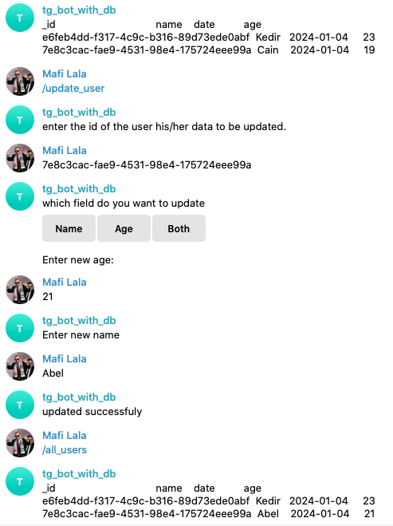
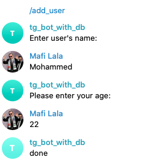
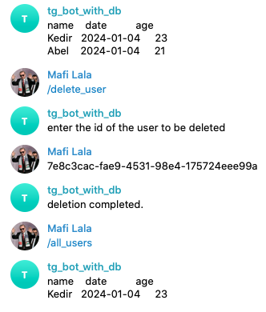
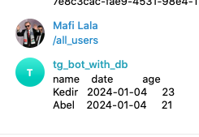

# Implementation of this example bot is deployed and it is found by the telegram handle [@tg_bot_with_db](https://t.me/tg_bot_with_db_bot)

⚠ It is not deployed, but you can run the code on codespaces or localy and use the bot

# Done by: Maruf

# Bot Commands implemented: `/add_user`

# : `/all_users`

# : `/get_user_by_id`

# : `/update_user`

# : `/delete_user`

## Demo of all commands implemented

### update user

### add user

### delete user

### show all users

